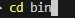
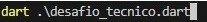
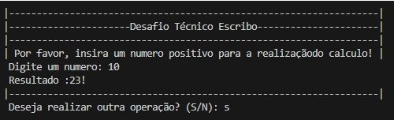

# Desafio Técnico Escribo

## No Terminal do VSCode, você executara os seguintes passos:

 1ª: navegar para => desafio_tecnico\bin
 
*  
2ª: excutar => dart .\desafio_tecnico.dart

*  

E depois é só interargir com o terminal

 
